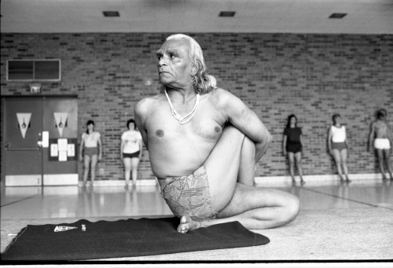
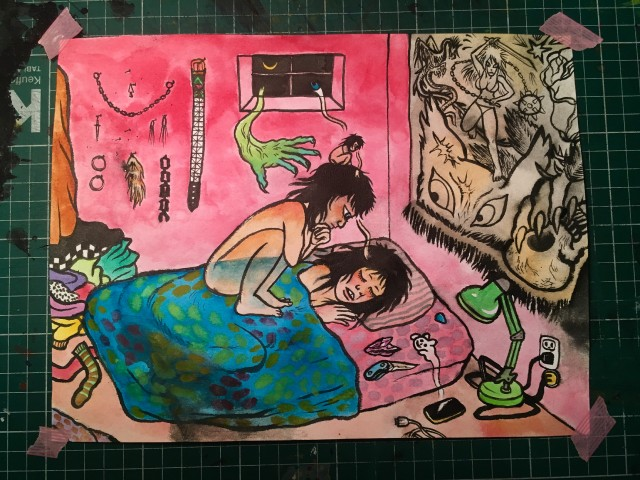
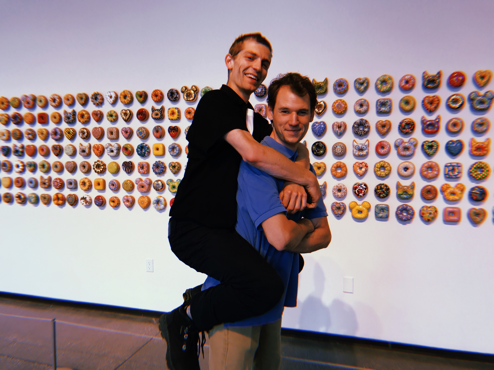

## 2020-01-13



The Ann Arbor YMCA, September 24, 1984

Here's a bibliography for some gymnastics that I'm getting into.

1. Works of B. K. S. Iyengar.
```
1966-iyengar-light-on-yoga
2002-iyengar-light-on-the-yoga-sutras-of-patanjali
```

2. Academic commentary on scriptures.
```
2018-cohen-the-upanishads-routeledge
2016-ithamar-exploring-the-bhagavad-gita
2017-mallinson-singleton-the-roots-of-modern-yoga
```

3. Anglophonic histories.
```
2004-alter-yoga-in-modern-india
2005-de-michelis-elizabeth-history-of-modern-yoga
2010-singleton-yoga-body-the-origins-of-modern-posture-practice
2010-freeman-the-mirror-of-yoga
```

4. Creative non-fiction and other positive admonishments.
```
2006-tharp-the-creative-habit
2009-adele-the-yamas-and-niyamas-exploring-yoga-as-ethical-practice
2012-cope-the-great-work-of-your-life
2014-snyder-martin-nobody-home-writing-buddhism-and-living-in-places
```

## 2020-01-10

[](http://blog.inechi.com/2019/11/2019.html)

From Inés Estrada, March 2019.

## 2020-01-04

I might be motivated to work *for a particular person* rather than on *a specific project*. 

This style of motivation is appropriate because I've given up on logging time for myself. 

From my experience with kan-ban and without a cell phone over the last 3 months (since failing two prelims this Fall), I recognize I just shouldn't *actively* track myself when I'm "working on myself". (I have some *passive trackers*, e.g., time series data for my heartrate, my sleep, and my approximate location. But I don't have to remember do anything to collect this data, and I get to analyze it post hoc.)

At the same time, I *would like* to actively track myself, so I'm trying to be attentive (when I'm working) to *whom* I feel I am working for, rather than fretting to much about *what* I am doing.

- chores for myself
- rdai docs for Matt
- rdai database for Tom
- topology notes for Agnès
- algebra notes for Peter
- analysis notes for Sergei 

## 2020-01-01



From this summer with Sam.

## 2019-06-04

Since I'm liable to forget, I'll describe my current "PIM schema" by cataloging 

- my `$HOME` directory, 
- what I have on paper, and 
- software I subscribe to for managing projects.

### `$HOME`

I have a Lenovo T420, whose name is `lobster`. My home directory looks something like 

```
colton@lobster:~$ tree -L 1
.
├── art
├── blog
├── coltongrainger.bib
├── cv
├── Dropbox
├── fy
├── journal
├── lec
├── lit
├── mus
├── pho
├── raw
├── README.md
├── rec
├── rote
└── wiki
```

During "fiscal year 2019" (i.e., Jun 2018 to May 2019), I commonly worked commonly in

- `fy` (projects for the "fiscal year")
- `wiki` (materials for <https://quamash.net>)
- `raw` (scanned handwritten notes, hence `raw`) and
- `rote` (tab separated files for mnemosyne).

The previous two years (modulo a few details) look like

```
colton@lobster:~$ tree -L 1 fy/18
fy/18
├── 2017-09-job-apps
├── 2018-04-16-offer-letter-cu-boulder.pdf
├── 2018-04-27-picklebric-application.txt
├── 2018-06-18-tutoring
├── bulma-0.7.1
├── coding-with-kids
├── cogr-webpage
├── coq
├── data-management-plan
├── diagnostic
├── dishwashing
├── eo
├── fscss-interviews
├── fscss-private
├── fscss-wiki
├── fscss-work
├── grad-apps
├── grad-funding
├── grap-apps.bak
├── hakyll
├── leading-lesson
├── logos
├── mentoring
├── mnep-script
├── notedown
├── num
├── odes
├── PreTeXt-mathbook
├── prob
├── py
├── PythonDataScienceHandbook
├── rcf
├── spoken-word
└── tex-templates
```

and 

```
colton@lobster:~$ tree -L 1 fy/19
fy/19
├── 2018-06-alg1-top1-ana1.pdf
├── 2018-06-until-2019-02.pdf
├── 2019-03-topology-seminars.pdf
├── 2019-05-11-top2-omnibus.pdf
├── alg1
├── alg2
├── clothing
├── cu3d
├── diffgeo1
├── dircolors-solarized
├── examples
├── internships
├── mitschriebwiki
├── napkin-outline
├── neural-network
├── orientation
├── prelims
├── prob1
├── project-ideas
├── records-and-old-todo
├── ripser
├── RISE
├── safe
├── slow-pitch
├── soml
├── stylefiles
├── summer-review
├── ta
├── TDAstats
├── top1
├── top2
├── tripos-course-guides
├── unicode.sh
├── vim-tex-fold
└── yst
```

About 75% of repositories I have on github (for lack of a better name) are prefixed with, e.g., `fy00`, to indicate that they are locally saved under, e.g., `$HOME/fy/00/`.

I only have digital directories under `fy` back to (about) 2009--2010, when I was spending quite a bit of time after school with "kdawg wangalicous" and the policy debate topic was 

> Resolved: The United States federal government should substantially increase social services for persons living in poverty in the United States.

```
colton@lobster:~/fy/10$ tree
.
├── 2009-apology-to-davidson.txt
├── 2009-GDI-Nietzsche-K.pdf
├── 2009-GDI-Objectivism.pdf
├── 2009-UTNIF-Carceral-Archipelago-K.pdf
├── 2009-UTNIF-Marxism-K.pdf
├── 2009-UTNIF-Standpoint-Epistemology-Critique.pdf
├── 2010-ecopanda-behemoth.pptx
├── 2010-ganatos-nary-slender-script.txt
└── 2010-mein-lieblingsplatz.txt
```

This coming year looks like

```
colton@lobster:~$ tree -L 1 fy/20
fy/20
├── aiwatch
├── analysis
├── applied-analysis
├── nsf-grf
├── pandas
├── rda-image-archive
├── siparcs
└── topology-prelim
```

Last year, I used my dropbox to sync notes (written in Notability on my tablet) and pdfs. 

```
colton@lobster:~$ tree -L 1 Dropbox/
Dropbox/
├── Crypted
├── Downloads
├── export
├── import
└── todo.txt
```

This year, I plan to keep pdfs in google drive and designate dropbox as my download folder. (I have an SD card for torrent files >2GB.)

### Paper

I am abandoning *taking notes* on my tablet, because the generated pdfs were large (~100MB) and I realized that Notability was just another (however sleek) WYSIWYG editor in which I wasted my time and was often frustrated with formatting. The alternatives look like

- notes in `latex` or `markdown` on my laptop
- notes in a (chronological) series of 13x21 cm, un-ruled, [cahier journals](https://web.archive.org/web/20190516162841/https://us.moleskine.com/cahier-journal-brown/p0408)
- notes on paper, scanned as dated pdfs to `raw`

I may scan the cahier journals pages (as done by mpacer here <https://mpacer.org/qualifying-exam-materials/#/qualifying-exam-written-portion/>). Primarily however, in leaving the tablet for paper, I'm following <https://usesthis.com/interviews/jeremy.kun/>:

> ... I have specificity for writing implements on par with my vim configuration. I use a very specific kind of notepad---unruled, cheap, abundant, low-weight stock---and similarly specific notebooks---small, unruled. I can never use paper or a notebook that I feel is too fancy to house my unendingly bad ideas and egregious mistakes. The only good paper is paper for which, when you throw it on the ground and grab a new sheet to start over, you don't feel bad. Lined paper is hell. I prefer 0.9 mm lead mechanical pencils, though more often than not a 0.7 mm Bic is what I have handy.

At the same time, I will keep *books* and lecture notes that are *polished and proofread* on my tablet, to save weight and leave room in my backpack for plenty of snacks.

### Software

Tersely, I subscribe to use the following software.

- trello
    - for a single todo list,
    - and a single reading list.
- pinboard
- zotero
- github

Each week, I put ~15 links in pinboard, ~30 cards in trello, and ~3 citations in zotero. 

I abandoned emacs org-mode for my TODO list because 

- I didn't find any use for clocking my time, 
- my use was too ephemeral to properly learn org-mode's chording,
- I suffered through 2 weeks of "emacs configuration bankruptcy" in May 2018
- I couldn't stand to edit my TODO.org file on my phone.

I listen to music off my phone (connected to a Marshall Woburn Bluetooth speaker) via

- google play music, or
- the hype machine.

## 2019-04-19

Here's a viscerally boring design problem. 

---               | ---
lecture notes     | laptop or notebook 
reading scribbles | iPad or scratch
problem sets      | laptop or iPad

## 2019-04-08

My bibliography has gotten out of control. Leo told me to stop shopping around. But how?

> Ask for advice?

## 2019-03-23

Took a hiatus from updates to focus on coursework.

Trivial news: I've transitioned my notes and reading material to [Notability](https://www.gingerlabs.com/) for the iPad. As a result, most of my workflow is once again offline. 

By working from an iPad, however, I am happily meeting some immediate goals. These include:

- reading broadly for prelims,
- integrating my lecture notes with my reading notes, and
- frequently grinding through exercises.

## 2019-02-01

--- | ---
alg2 | free modules, feedback on written work, e.g., avoid vague notation such as "Let $\phi \in \mathrm{Hom}$" [@DF04 ch. 10.3]
diffgeo1 | manifolds with boundary, defining smooth maps, equivalent characterizations of smoothness [@Lee03, pp. 24--35]
top2 | relative chain complexes, pairs of topological spaces, tensor product review, cohomology with coefficients in $G$ [@Bre03, section IV.5]

## 2019-01-31

TA-ing. Not much math.

## 2019-01-30

--- | ---
alg2 | subobjects, direct sums, freely generated modules [@DF04 ch. 10.3]
diffgeo1 | smooth manifold chart lemma, Grassmannians [@Lee03, pp. 21--22]
top2 | presentations from problem sets; handling edge cases for the first homology group

Presentations were a bit nerve-racking when I realized that I had too heavy-handedly abelianized an infinite product. (See <https://mathoverflow.net/questions/35397>.) Ulrich and I found a counter example where $[\prod G_i, \prod G_i] \subsetneq \prod [G_i, G_i]$. I was then incensed to straighten out *which* (co)products exist in *which* concrete categories I'm usually working in.

## 2019-01-29

- Revised some module theoretic arguments for Green into two-column proofs.
- Caught up on basic (topological) properties of manifolds. 
- Prepared for [presentations](https://github.com/coltongrainger/fy19top2/blob/master/2019-01-30-intro-homology.pdf) in top2.

I was glad to attend the organizational meeting for the [topology seminar](https://sites.google.com/view/cutopology/spring-2019?authuser=0). From Beaudry's introduction:

> This semester, we will cover some of the topics in homotopy theory that make an appearance in the work of Freed–Hopkins–Teleman on topological phases of matter. This seminar will be parallel to the Mathematical Physics seminar (Wednesdays from 3-4 pm in MATH 350) but will be for the most part independent. This seminar will be about topology: To understand the connections to physics, you’ll have to read on your own or go the other seminar. We have an ambitious schedule (see plan). It’s not a bad idea to read up a bit on the topics before the talks since we’ll be covering material fast.

The [math-physics](https://math.colorado.edu/seminars/) seminar is co-organized with Prof [Hermele](https://spot.colorado.edu/~hermele/), whose research is in theoretical condensed matter physics. 

## 2019-01-28

--- | ---
alg2 | finitely generated modules [@DF04, ch. 10.3]
diffgeo1 | smooth structures, transition maps [@Lee03, pp. 10--16]; spheres, level sets [@Lee03, pp. 17--23]
top2 | exact sequences of chain complexes, the [Bockstein homomorphism](https://en.wikipedia.org/wiki/Bockstein_homomorphism)

## 2019-01-27

Notes from Clelland. Basic examples of smooth manifolds. Finished modules problem set from [@DF04, ch. 10.2].

## 2019-01-26

Notes from Green on modules.

## 2019-01-25

Lectures. In top2, Beaudry mentioned that "if we didn't like that game" [forcing maps defined out of the cycle group $Z_1(X)$ to descend to the quotient $H_1(X)$] "then we would like it soon because we were about to play it *hard.*" Lol.

In the afternoon, I set up definitions for functor categories and generally the category of quivers (directed graphs).

Talked a bit with Ulrich about duality and Gelfand–Naimark, which motivated me to try and rope the content in alg2 and diffgeo1 closer together. (Ulrich also suggested that I push to do homological algebra sooner than later.)

## 2019-01-24

In prob1, we defined random variables and set up results to guarantee the existence of a random variable that's equal in distribution to whatever probability measure we have chosen. Also defined cdfs, pdfs, and pmfs, with reference to the Lebesgue decomposition theorem.

I spent the rest of the day TA-ing. I decided to [abandon](https://prooflogger.quamash.net) prooflogger since only a third of the sections had anything to do with it. I was brought to my senses by Ulrich, after he mentioned that he only attended recitations in Trondheim to drop off homework.

## 2019-01-23

Lectures.

- In top2, we set out to prove Hurewicz's theorem.
- In alg2, we defined module homomorphisms and started to construct some sort of chain of $F[x]$-modules.
- In diffgeo1, we stated topological properties of manifolds [@Lee03, pages 5--9] and exhibited spheres, products, and projective spaces as manifolds with charts.

## 2019-01-22

I spent the day solidifying my argument for [the smooth chain rule in Banach spaces](https://quamash.net/diffgeo1#banach-spaces-and-the-smooth-chain-rule). Also finished [@DF04, section 10.1].

## 2019-01-21

Went through Lang's introduction [@Lan99, ch. 1] to topological vector spaces.

## 2019-01-20

I translated Folland's "first look" at functional relations into intuition for the dimension and symmetric properties of repeated Fréchet derivatives.

I surveyed proofs for inverse function theorems and implicit function theorems [@Fol02, ch. 3.1], [@HH15, ch. 2.10], [@Lee03, no. C.34].

## 2019-01-19

Worked through the motivating historical calculus in Massey's [Singular Homology Theory](https://www.springer.com/us/book/9781468492330) [@Mas80, chapter 1]. (Massey develops homology theory with $n$-cubes rather than simplices---why? To have oriented $n$-cubes available as integrands? Does some argument/limiting process fail when working with an infinitesmally thickening mesh of simplices?)

I struggled with notation for repeated applications of the Fréchet derivative. Got distracted in considering repeated linear transformations as vectors spaces themselves in the category of topological vector spaces. Skimmed related results in I.3 of Lang's [Fundamentals of Differential Geometry](https://www.springer.com/us/book/9780387985930) [@Lan99, chapter 1].

In Folland, I gladly found two problems that matched gaps in my knowledge: one to do with Lagrange multipliers and the spectral theorem, the other to do with setting up a meaningful definition of higher Fréchet derivatives.

> Let $A$ be a symmetric $n \times n$ matrix, and let $f(\vec{x}) = (A \vec x) \cdot \vec x$ for $\vec x \in \mathbf{R}^n$. Show that the maximum and minimum of $f$ on the unit sphere $\{ \vec x : \lvert\vec x\rvert = 1\}$ are the largest and smallest eigenvalues of $A$. [@Fol02, number 2.9.19]

> Suppose $f \colon \mathbf{R}^n \to \mathbf{R}$ is of class $C^2$; then $\nabla f$ is a $C^1$ mapping from $\mathbf{R}^n$ to itself. Show that $D(\nabla f)$ is the Hessian matrix of $f$. [@Fol02, number 2.10.6]

## 2019-01-18

Lectures.

- Alg2: In the category of modules, we defined homomorphisms, kernels, quotients, and began to state a series of familiar isomorphism theorems [@DF04, chapter 10.2].
- Diffgeo1: Stated the implicit function theorem [@Lee03, chapter C], and defined a topological manifold [@Lee03, chapter 1].
- Top2: Reasoned about long exact/non-exact sequences of abelian groups.

I found out that I conditionally passed the algebra prelim, and so, made a haphazard sketch of work to do.

term | workload
--- | ---
He18 | Algebra 1, Topology 1, StatOptML (algebra prelim)
Fr19 | Algebra 2, Topology 2, DiffGeo1 (topology prelim)
So19 | SIParCS, CU MRE, NSF apps
He19 | Algebra (Green, Wise, Casalaina-Martin), Analysis 1, Numerics (Bradley, Meiss, Becker, Raf)
Fr20 | Analysis 2, Complex Analysis, Algebraic Topology (Pflaum, Beaudry)
So20 | Talbot, more NSF apps, teaching
He20 | topic proposal, advisors in MATH/APPM/CS

(I have 90% confidence that I will stave off probability until next year.)

(Update: Maybe quantum physics with Hermele next year?)

## 2019-01-17

Mostly teaching, then munging surveys I had put out to the calculus sections. I went to the first meeting for a reading course in probability/measure theory. (I then had about 0.3 confidence I would drop.) 

I reviewed the chain rule in Folland's [Advanced Calculus](http://www.math.ucla.edu/~iacoley/32H.pdf) [@Fol99, chapter 2.3], and derivatives in several variables as linear transformations in Hubbard's [A Unified Approach](http://matrixeditions.com/5thUnifiedApproach.html) [@HH15, chapter 1.7--1.9].

## 2019-01-16

Lectures again, worked to flesh out definitions for modules and simplices. Made progress in defining *two* functors: 

- $\Delta ( - )\colon \mathsf{Top} \to \mathsf{Ch}$ (by moving from graded abelian groups to chain complexes), and
- the correspondence 'tween $F[x]$-modules and $F$-vector spaces $V$ with a chosen endomorphism $V \to V$.

## 2019-01-15

Attended offices hours for top2. Asked how to distinguish the monodromy action from action of the group of deck transformations. Got permission to stop reviewing top1 (woot!) and pass onto homology.

Thought about morphisms of vector spaces from a categorical perspective. Skimmed Breezer's [FCLA](http://linear.ups.edu/html/fcla.html) (elementary matrices as transformations, 4 subspaces, similar and diagonal matrices). Worked through examples (especially notation) in PCM I.3.4. Slowly began to understand why one would want eigenvector bases to study subspaces "stable" under linear transformation.

Also spent an upsetting amount of time configuring pandoc on my laptop and server. Gross. I don't even see how the software is held together. Way beyond me.

## 2019-01-14

Started lecture notes for [Topology 2](https://quamash.net/top2) (top2), [Differential Geometry 1](https://quamash.net/diffgeo1) (diffgeo1), and [Algebra 2](https://quamash.net/alg2) (alg2). Linearity is 4sure the unifying theme of the week. Notably, diffgeo1 made a whirlwind tour of Appendix B in Lee's *Introduction to Smooth Manifolds*.

## 2019-01-13

I previewed syllabi and reading for the next 2 weeks.

- Homology in Hatcher, Bredon, and May;
- Modules in Dummit & Foote;
- Linear Algebra/Calculus review in Lee.

I also setup <https://cu3d.github.io>, a catalog of 3D-printed models, for the MARC.

## 2019-01-12

Errands. Odds & ends from last semester's `todo.org`. I had a lengthy, meandering conversation with two older grad students (TK & Carly) about faculty transitions at CU in the last 6 years. I realized how convenient <https://aiwatch.issarice.com> was for summarizing rank/career changes. Not much math.

## 2019-01-11

More teacher training. Finished my [SIParCS application](https://github.com/coltongrainger/internships/blob/master/statements/siparcs-climate-models.md). Mnemosyne.

## 2019-01-10

Attended teacher training. Finished transcribing an [interview with Leah Buechley](https://github.com/coltongrainger/neural-network/blob/master/posts/2018-09-10-leah-buechley.md). Setup duplicity with google cloud platform. Defragmented my gmail archive.

## 2019-01-09

Took the topology prelim. Answered 3 of 6 questions in point-set and algebraic topology.

- separation properties
- applications of Seifert van-Kampen
- homotopy groups of real projective space

Talked to TK: what to review for differential geometry? 

- multilinear forms up to the definition of a tensor product
- implicit and inverse function theorems

## 2019-01-08

More chores, etc. I installed KeePassX.

## 2019-01-07

As a chore and measure of progress, I attempted the algebra prelim.

- I struggled to understand possible group actions of $Q_8$ on $\{1, \ldots, n\}$. In a dilemma, I wrote out a treacherously long table of conjugacy classes for $S_n$, $n = 4, \ldots, 7$ and made a confusing argument about normal subgroups as unions of conjugacy classes.

- Afterwards, Andre and I discovered a one-liner to show "$Q_8 \le S_n$" is absurd for these cases.

    > When $Q_8$ acts on $I_n$ for $n < 8$, the stabilizer of any point in $I_n$ contains $-1$, whence $-1$ is in the kernel of the action.

- Also afterwards, when I needed to determine which primes in $\mathbf{Z}$ were also Gaussian primes, I found myself impressed with Weissstein's [MathWorld](https://en.wikipedia.org/wiki/MathWorld).

- I expect the Slack channel Chris and I were using to study will soon be defunct.

- To shift gears for topology, I passed over a survey: [PCM IV.10](http://catdir.loc.gov/catdir/toc/ecip0818/2008020450.html). 

## 2019-01-06

Chris and I ran through Micky's group theory notes. I discovered Zassenhaus' [The Theory of Groups](https://books.google.com/books?id=_lOycgz7bQYC) and skimmed through chapter IV on $p$-groups and Sylow $p$-groups. 

To de-stress before the prelim, I browsed the OED for historical uses of `morphism`, `quaternion`, `group`, `ring`, `field`. (I found Zassenhaus under `quaternions`.)

## 2019-01-05

I continued to atomicize mnemosyne cards by expanding "naive" procedural topics from the GRE. I went through a proof of Sylow's theorems and thought about the conjugation and left translation action of a group $G$ on its $p$-groups. 

<!--
I set up a [fact sheet for internship applications](https://github.com/coltongrainger/internships) this summer.
-->

## 2019-01-04

Chris and I sat for a timed [practice exam](https://github.com/coltongrainger/fy19alg1/blob/master/2019-01-04-algebra-sep-practice.md), adapted from Ed Dummit's 2014 [algebra summer enhancement program](https://sites.google.com/a/wisc.edu/math-intranet/home/quals). I feel silly taking the exam before I know what I'm doing, but 

- there's a timeline, and 
- our dept chair emphasizes ["trusting oneself"](http://math.colorado.edu/~kstange/gradstudy.pdf) to seek out "new challenges and novel contexts". 

Her accompanying advice is, of course, to "doubt oneself" and "build what you know", which I look forward to reverting to after next week.

I compiled Micky Steinberg's [2014 group theory notes](https://www.math.wisc.edu/~micky/grouptheory.pdf) into a [light-hearted practice exam](https://github.com/coltongrainger/fy19alg1/blob/master/2019-01-05-algebra-micky-practice.md) for tomorrow.

## 2019-01-03

Chris talked me through problems 1--3 on CU's [Jan 2008 algebra prelim](https://github.com/coltongrainger/prelims/blob/master/2008-01-15-cu-algebra-prelim.pdf), which I didn't understand. For prob 2, we needed to make a recursive argument to find a nontrivial abelian normal subgroup of prime power order in a finite solvable group. Ian also mentioned this problem (with enthusiasm) before break, so I might revisit it.

I started reviewing from [Hubbard](http://matrixeditions.com/5thUnifiedApproach.html), following the [week 1](https://canvas.harvard.edu/courses/45219/pages/weekly-schedule) schedule for Paul Bamberg's [Math 23a](https://canvas.harvard.edu/courses/45219/files/6701269/download?verifier=Yvcu1AARsTzhWbCTmjtM2cT0BWA4sCCxBS3VftOE&wrap=1). (The supplemental materials for math 23a are great, and I think I'll exhaust most of my free time before Jan 14 going over these.) 

Lastly, I went through exercises in I.1 Fields from Halmos's [Finite Dimensional Vector Spaces](https://www.springer.com/us/book/9780387900933), which is admittedly out of date. I'm going through Halmos, however, because

- I found a hardcopy in the math dept's reading room, and 
- I was impressed when I skimmed [Halmos's and Steenrod's](https://news.ycombinator.com/item?id=16829440) 1973 *How to Write Mathematics*.

## 2019-01-02

Distracted today: I setup yst to compile yaml data into a [CV](https://coltongrainger.com/cv), as per Dom Moritz's <https://domoritz.de/cv/>. Dom's job-hunting stress thoroughly dosed me (by proxy) with timeline stress, and, incidentally, I spent the day "signalling".

## 2019-01-01

I revised cards on introductory measure theory, also group actions. I continued through a backlog of reviews I owed mnemosyne from last semester. 

(Oddly as well, I flicked through photos from 2018 back to the beginning of 2016, when I was skiing a bit and preparing to graduate. From my undergraduate coursework, maybe I'm only interested to mnemo-fy notes from electricity and magnetism? from ordinary differential equations?)

## 2019-12-31

I spent some time convincing myself that "chunking mathematical concepts" would be more rewarding "completing prerequisites in a satisfactory order" after reading Michael Nielsen's [essay on anki](http://augmentingcognition.com/ltm.html). I reactivated [mnemosyne cards](https://quamash.net/maths-GRE) I had made studying for the math GRE. 

While revising cards I had starred for typos, I began to recognize I'd been trying to chunk concepts that were too complex for a first pass. (I found a particularly bad batch of measure theory cards---should delete these or just atomicize them?)

<!---
I finally setup a bitcoin wallet and skimmed [bitcoin is worse is better](https://www.gwern.net/Bitcoin-is-Worse-is-Better).
--->

## 2018-12-30

I finished <https://prooflogger.quamash.net>, which I hope Lee will allow me to force some of the calculus sections to use. [Here](https://quamash.net/math1300#participation) is an outline I'd give students. I aim to game students into presenting proofs to each other and providing constructive oral feedback.

## 2018-12-29

I thought about social support networks while travelling from Idaho back to Boulder, e.g., [the cohort effect](http://www.pgbovine.net/PG-Vlog-252-cohort-effects.htm).

## 2018-12-27

Following <https://nadiaeghbal.com/notes>, <https://issarice.wordpress.com/>, and <https://youtu.be/M2pGiBrw-Ns?t=422> I'm starting a working journal with a broad scope: early graduate school in the mathematics department at CU Boulder.

I haven't gotten permission to emulate any one of these authors, so I'm sort of planning to write in a manner that oscillates between each's style. In spite of the common medium (~daily entries) it seems each author's motivation is tangential to the other two's: writing for exploration, for transparency, for reflection.

I imagine I will be keeping this journal

- to narrate what I've been working on in a chronological fashion,
- to give myself encouragement by tracking progress through my coursework,
- to urge myself on (as in ski-racing, where we'd often yell at each other "up up up!").

I think it would be appropriate to include characteristic quotes, which motivate this journal.

Nadia Eghbal ([notes](https://nadiaeghbal.com/notes/))

> 11/26/18
>
> Realizing that I love to be alone, like in a physically low-stimulation environment, but I still think of myself as socially oriented even in that context. I still like texting/FaceTiming friends. And: I only want to be alone to work on ideas that I eventually take back to others. Like, if I were just writing for the sake of writing and not publishing it out, I’d probably get pretty bored and antsy

> 11/26/18
>
> Amplification vs. exploration: Usually I say that I prefer writing to talks/interviews bc I can think better through writing over speaking. But I think another big reason is bc people often want you to talk about stuff you’ve already done, which is not that interesting to me. Whereas with blog posts, it’s my blog, I don’t really care if you read it or not, I’m just putting stuff out there and hopefully connecting with a few ppl who feel the same way. To me, writing is pushing to the edges, exploring the limits of my identity and what I’m comfortable sharing in public. Whereas any other form of communicating ideas feels performative: I’m rehashing things I already know, and that you know me for. Also why I had to get off Medium (bc it made blogging feel performative)

Issa Rice ([a note on scope of updates](https://issarice.wordpress.com/2018/12/01/a-note-on-scope-of-updates/))

> As I stated at the beginning, this blog came about because I wanted to make available information about “what I’m up to” in cases where “what I’m up to” doesn’t naturally lead to public updates. So I think it’s not so important to record things on here when the same information can be obtained through other sources (i.e. my public activity on other websites).
> 
> However, I also want to have some kind of conceptual coherence about this blog. And since the overlap between “my activity that doesn’t naturally lead to public updates but where I would like to make public updates available” and “my AI safety learning” is nearly perfect, I think I will track the former by writing about the latter.

Philip Guo ([vlog transcript, talking about his journal](https://youtu.be/M2pGiBrw-Ns?t=272))

> anyways so when I started my postdoc I thought of this idea I don't know how I thought of it but I thought this idea that I would just keep a running diary of anything that I've encountered that to work-related that I felt like writing down. so it was very simple. I created a text file. this is my first one (reading it) this is really funny I'm just reading this. this is July 2013, my first month as a postdoc.
>
> > July 2013 I'm going to start a rough weekly work diary reflecting on my thoughts about life as a young academic. I need to focus more on how I feel rather than what I did since it's easy to later reconstruct what I did from other artifacts but it's hard to recreate old feelings. this diary is gonna be quite rough and I don't want to hold myself to a strict writing schedule. let's keep this fairly freeform and low-key. 
>
> once again in parentheses I said: focus on how I feel rather than just what I did

## References 

(This section TODO.)

